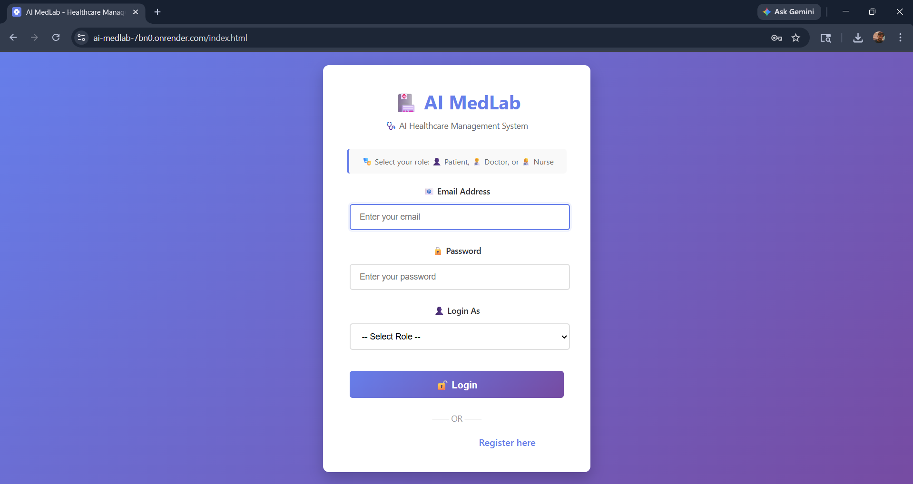
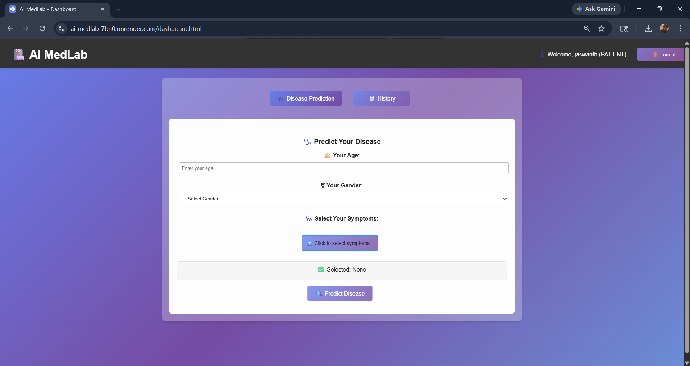
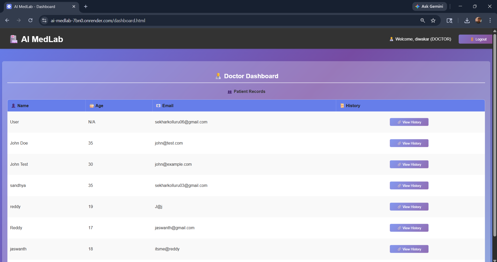

# AI MedLab – Intelligent Healthcare Management System

A full-stack AI-powered healthcare platform for disease prediction, patient management, and automated report generation.

🔗 **Live Demo:** https://ai-medlab-7bn0.onrender.com

 Report | PPT |  Paper → linked below 👇

---

##  Overview

AI MedLab is a role-based healthcare system that integrates machine learning with a web application to assist patients, doctors, and nurses. 
It enables disease prediction, health recommendations, and structured medical report generation.

---

##  Key Features

*  Role-Based Authentication (Patient / Doctor / Nurse)
*  Disease Prediction using Machine Learning
*  Personalized Health Recommendations
*  Automated PDF Report Generation
*  Patient History Tracking
*  Fully Deployed Web Application

---

##  Screenshots

###  Login Page



###  Dashboard



###  Prediction Result



---

##  Project Architecture

```
Frontend (HTML, CSS, JS)
        ↓
Flask Backend (API)
        ↓
Machine Learning Models
        ↓
Data Storage
```

---

## 🛠️ Tech Stack

| Layer      | Technology            |
| ---------- | --------------------- |
| Frontend   | HTML, CSS, JavaScript |
| Backend    | Flask (Python)        |
| ML Models  | Scikit-learn, XGBoost |
| Data       | CSV / JSON            |
| Deployment | Docker + Render       |

---

##  Run Locally

```bash
git clone https://github.com/jaswanthhreddy/AI-Medlab.git
cd AI-Medlab
pip install -r requirements.txt
python Backend/app.py
```

Then open:

```
http://localhost:5000
```

---

##  Docker Deployment

```bash
docker build -t ai-medlab .
docker run -p 10000:10000 ai-medlab
```

---

##  Documentation

 **Project Report:** [View Report](docs/ai_medlab_report.pdf)  
 **Presentation:** [View Presentation](docs/ai_medlab_presentation.pdf)  
 **Research Paper:** [View Paper](docs/ai_medlab_research_paper.pdf)
---

##  Deployment

The project is deployed using Docker on Render:

🔗 https://ai-medlab-7bn0.onrender.com

---

##  Future Improvements

*  Database integration (MongoDB / SQL)
*  Mobile application version
*  Deep learning-based predictions
*  JWT authentication & enhanced security

---

## Author

**Jaswanth Reddy Bandi**  
<p>
  <a href="https://www.linkedin.com/in/jaswanth-reddy-bandi-899525289/" target="_blank">LinkedIn</a> |
  <a href="https://github.com/jaswanthhreddy" target="_blank">GitHub</a>
</p>


##  License & Usage

This project is protected under **All Rights Reserved**.

 You are NOT allowed to copy, modify, distribute, or reuse this project without explicit permission from the author.

 For any usage requests, please contact the author.

---

##  Support

If you found this project useful, consider giving it a ⭐ on GitHub!
